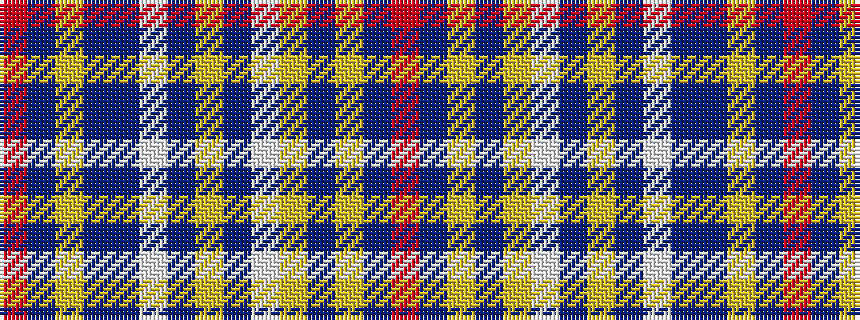

RBYBBWBYBWYBYBR

It is a 15 stripe tartan.

<figure class="pat-woven">

<figcaption>idealised sample</figcaption>
</figure>

## Colour Sequence



## Tartans with this colour sequence

| Tartans |
|---------------|
| [Wells, Greg Dress (Personal)](/variants/s15/r6do1lo2do1dp15w2do7lo1do7w2lo15do1ly2do1r6~x2/)|
||
