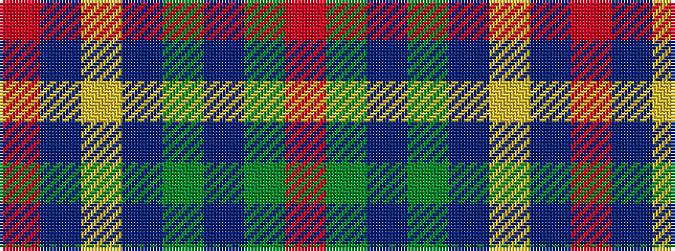

RBYBGBGR

It is a 8 stripe tartan.

<figure class="pat-woven">

<figcaption>idealised sample</figcaption>
</figure>

## Colour Sequence



## Tartans with this colour sequence

| Tartans |
|---------------|
| [Earl of Inverness (Artefact)](/setts/s8/r42dp4ly1dp6g1dp1g1r12~x2/)|
||
| [Inverness Earl of](/setts/s8/r42db4ly1db6dg1db1dg1r12~x2/)|
||
| [Inverness, Earl of](/setts/s8/r42db4ly1db6g1db1g1r12~x2/)|
||
