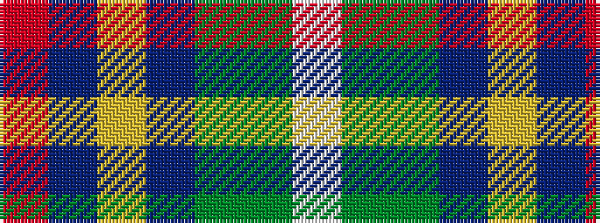

RBYBGGW

It is a 7 stripe tartan.

<figure class="pat-woven">

<figcaption>idealised sample</figcaption>
</figure>

## Colour Sequence



## Tartans with this colour sequence

| Tartans |
|---------------|
| [Wagland](/variants/s7/r3db6ly2db15dg12g39w3~x2/)|
||
| [Wagland (Name)](/variants/s7/r3db6ly2db15g12dg39w3~x2/)|
||
