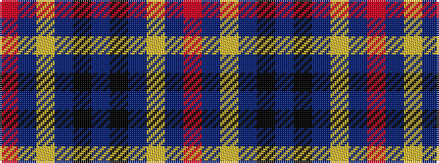

RBYBKBKBYBR

It is a 11 stripe tartan.

<figure class="pat-woven">

<figcaption>idealised sample</figcaption>
</figure>

## Colour Sequence



## Tartans with this colour sequence

| Tartans |
|---------------|
| [Rangers Football Club Dress](/variants/s11/r2db6lr2db2k9dbi30k9db5lr4db2r2~x2/)|
||
