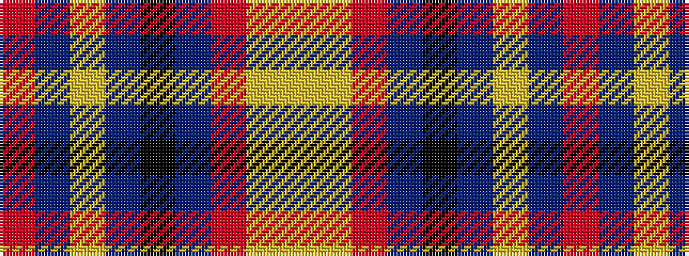

RBYBKBRYY

It is a 9 stripe tartan.

<figure class="pat-woven">

<figcaption>idealised sample</figcaption>
</figure>

## Colour Sequence



## Tartans with this colour sequence

| Tartans |
|---------------|
| [Uddingston Rugby Club Centenary (Cor](/setts/s9/r24b14lo2b3k2b6r38lo1lr2~x2/)|
||
