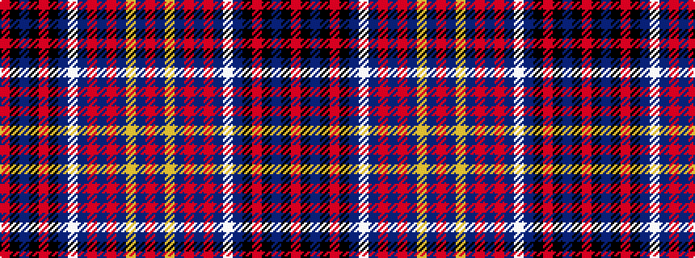

RBYBRBRBWBKRKBKR

It is a 16 stripe tartan.

<figure class="pat-woven">

<figcaption>idealised sample</figcaption>
</figure>

## Colour Sequence



## Tartans with this colour sequence

| Tartans |
|---------------|
| [Crieff High (Corporate)](/variants/s16/r5k1n2k1r3k1n35lb1n2r3n3r2n3lo1n1r5~x2/)|
||
