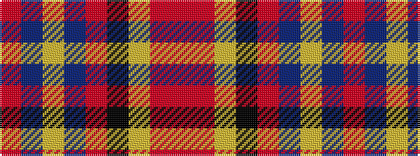

RBYBRKYRR

It is a 9 stripe tartan.

<figure class="pat-woven">

<figcaption>idealised sample</figcaption>
</figure>

## Colour Sequence



## Tartans with this colour sequence

| Tartans |
|---------------|
| [Jardine, of Castlemilk](/variants/s9/r8o33ly33k33r8db8ly33db8r8/)|
||
