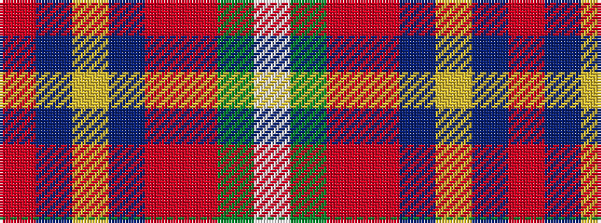

RBYBRRGW

It is a 8 stripe tartan.

<figure class="pat-woven">

<figcaption>idealised sample</figcaption>
</figure>

## Colour Sequence



## Tartans with this colour sequence

| Tartans |
|---------------|
| [WCWM 3947](/setts/s8/o2b30ly3b2o16r2g16w2~x2/)|
||
