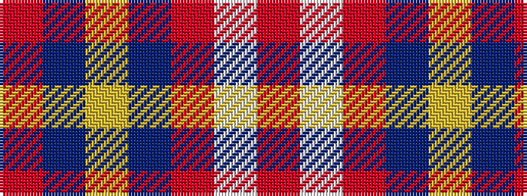

RBYBRWR

It is a 7 stripe tartan.

<figure class="pat-woven">

<figcaption>idealised sample</figcaption>
</figure>

## Colour Sequence



## Tartans with this colour sequence

| Tartans |
|---------------|
| [Brodie Silver Clan Tartan](/variants/s7/r3n20ly2n20o20lb20r3~x2/)|
||
