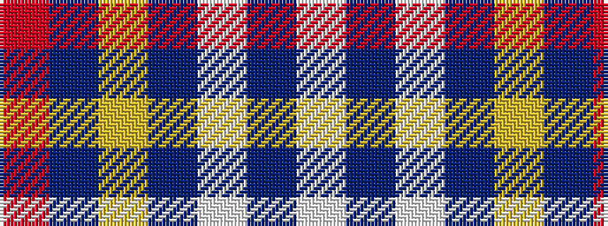

RBYBWBW

It is a 7 stripe tartan.

<figure class="pat-woven">

<figcaption>idealised sample</figcaption>
</figure>

## Colour Sequence



## Tartans with this colour sequence

| Tartans |
|---------------|
| [Easton (2014)](/setts/s7/r3db2ly1db50w1db2lb3~x2/)|
||
