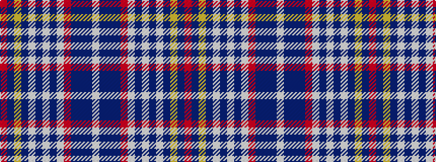

RBYBWBWBWRBBBW

It is a 14 stripe tartan.

<figure class="pat-woven">

<figcaption>idealised sample</figcaption>
</figure>

## Colour Sequence



## Tartans with this colour sequence

| Tartans |
|---------------|
| [Submariners](/variants/s14/w4db1dbi12db1r8w8db8w2db1w2db24ly4db1r2~x2/)|
||
| [Submariners (Unofficial)](/variants/s14/w4dt1db12dt1r8w8dt8w2dt1w2dt24ly4dt1r2~x2/)|
||
