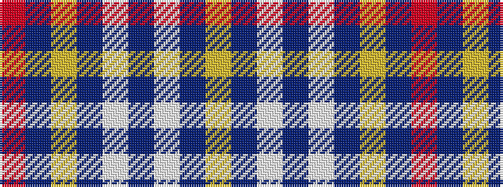

RBYBWBWBY

It is a 9 stripe tartan.

<figure class="pat-woven">

<figcaption>idealised sample</figcaption>
</figure>

## Colour Sequence



## Tartans with this colour sequence

| Tartans |
|---------------|
| [Rafferty (Estimated threadcount)](/variants/s9/r15b2lo1b10w1b2w1b2lo1~x4/)|
||
