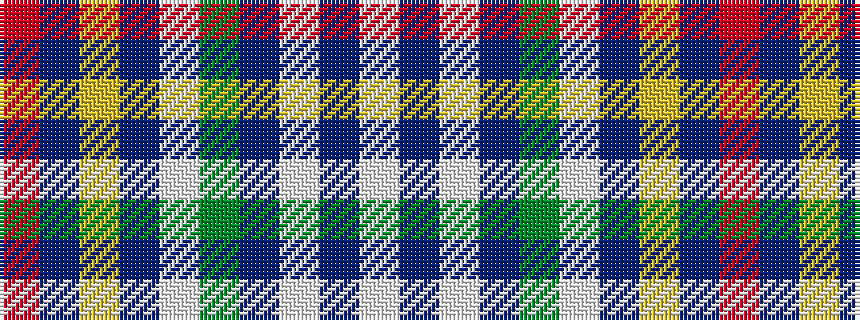

RBYBWGBWBW

It is a 10 stripe tartan.

<figure class="pat-woven">

<figcaption>idealised sample</figcaption>
</figure>

## Colour Sequence



## Tartans with this colour sequence

| Tartans |
|---------------|
| [World Youth Congress (Corporate)](/variants/s10/r2db8ly1db16w1g12db27w1db1w1~x2/)|
||
