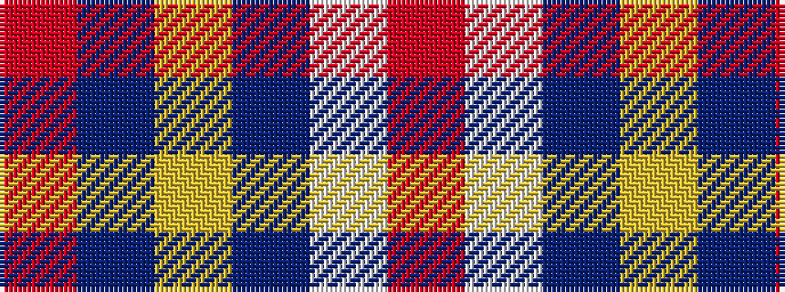

RBYBWR

It is a 6 stripe tartan.

<figure class="pat-woven">

<figcaption>idealised sample</figcaption>
</figure>

## Colour Sequence



## Tartans with this colour sequence

| Tartans |
|---------------|
| [Ploysongsang, Edward Thiravej (Pers](/setts/s6/r34w4t7ly10t7r18~x2/)|
||
| [Ploysongsang, Edward Thiravej (Personal)](/setts/s6/r34w4t7lo10t7r18~x2/)|
||
