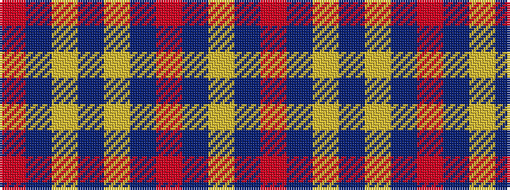

RBYBYBRBY

It is a 9 stripe tartan.

<figure class="pat-woven">

<figcaption>idealised sample</figcaption>
</figure>

## Colour Sequence



## Tartans with this colour sequence

| Tartans |
|---------------|
| [Bracken](/setts/s9/ly5db9r3db5ly2db4ly26t3r4~x2/)|
||
| [Bracken](/setts/s9/ly20db27r6db15ly8db11ly78db10r12/)|
||
