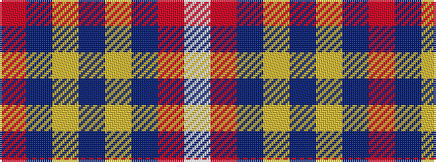

RBYBYBRW

It is a 8 stripe tartan.

<figure class="pat-woven">

<figcaption>idealised sample</figcaption>
</figure>

## Colour Sequence



## Tartans with this colour sequence

| Tartans |
|---------------|
| [Schöbitz (2016)](/setts/s8/r1dt23lo3b16lo3dt22r1w1~x2/)|
||
