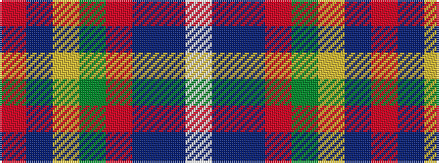

RBYGRBBW

It is a 8 stripe tartan.

<figure class="pat-woven">

<figcaption>idealised sample</figcaption>
</figure>

## Colour Sequence



## Tartans with this colour sequence

| Tartans |
|---------------|
| [Drummond of Fingask](/setts/s8/r48db3lo2g14r8db3t4w3~x2/)|
||
| [Drummond, (Fingask)](/setts/s8/r22db3ly1g12r6db3t3w1~x2/)|
||
