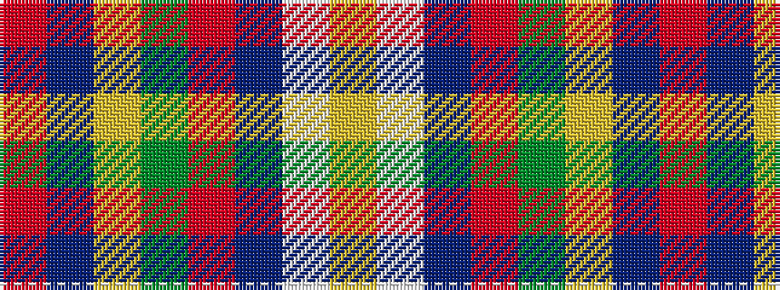

RBYGRBWY

It is a 8 stripe tartan.

<figure class="pat-woven">

<figcaption>idealised sample</figcaption>
</figure>

## Colour Sequence



## Tartans with this colour sequence

| Tartans |
|---------------|
| [Prince Charles Cloak](/variants/s8/r48db3ly1dg14r8db3lb4lr1/)|
||
