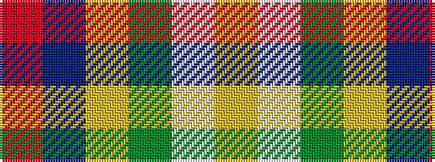

RBYGWY

It is a 6 stripe tartan.

<figure class="pat-woven">

<figcaption>idealised sample</figcaption>
</figure>

## Colour Sequence



## Tartans with this colour sequence

| Tartans |
|---------------|
| [Dundhuin Gold](/setts/s6/o59t28ly5dg3w4ly5~x2/)|
||
