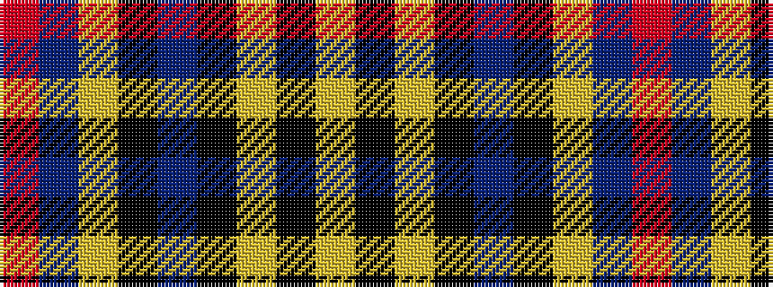

RBYKBKYKY

It is a 9 stripe tartan.

<figure class="pat-woven">

<figcaption>idealised sample</figcaption>
</figure>

## Colour Sequence



## Tartans with this colour sequence

| Tartans |
|---------------|
| [Ewbank](/setts/s9/r3b14ly2k2b14k36ly2k2ly2~x2/)|
||
