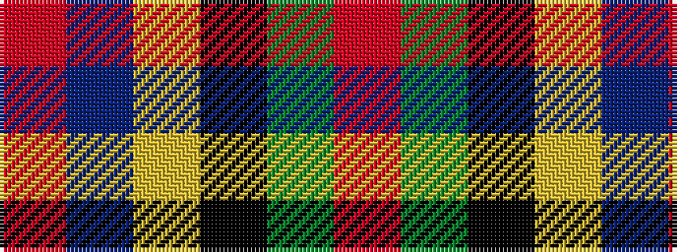

RBYKGR

It is a 6 stripe tartan.

<figure class="pat-woven">

<figcaption>idealised sample</figcaption>
</figure>

## Colour Sequence



## Tartans with this colour sequence

| Tartans |
|---------------|
| [Sinclair](/tartans/r30dg12k5lr2b6r30/)|
||
| [Sinclair Dress](/tartans/r28dg16k4lr1b6r28/)|
||
