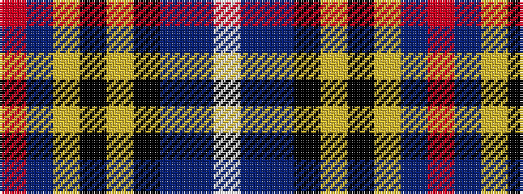

RBYKYKBBW

It is a 9 stripe tartan.

<figure class="pat-woven">

<figcaption>idealised sample</figcaption>
</figure>

## Colour Sequence



## Tartans with this colour sequence

| Tartans |
|---------------|
| [O'Reilly (Estimated threadcount)](/setts/s9/r4b3lr2k2lr12k2db10t25w2~x2/)|
||
