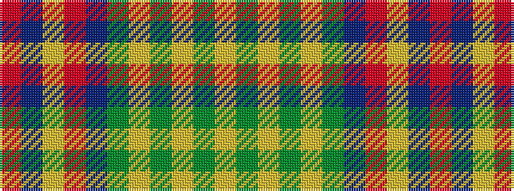

RBYRBGYGYGY

It is a 11 stripe tartan.

<figure class="pat-woven">

<figcaption>idealised sample</figcaption>
</figure>

## Colour Sequence



## Tartans with this colour sequence

| Tartans |
|---------------|
| [Bonnie Brae Corporate Tartan](/variants/s11/r6db3ly3ri32db24g32ly3g3ly3g3ly6/)|
||
