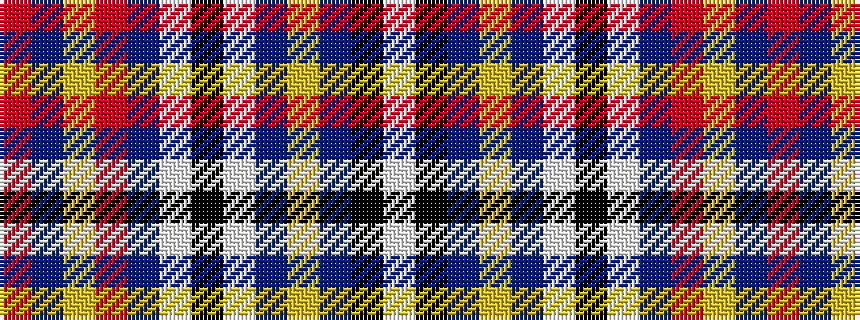

RBYRBWKWBYBKW

It is a 13 stripe tartan.

<figure class="pat-woven">

<figcaption>idealised sample</figcaption>
</figure>

## Colour Sequence



## Tartans with this colour sequence

| Tartans |
|---------------|
| [Stratford Police Pipe Band (Ontario)](/variants/s13/r5b2ly1r45b4w1k4lt9b2ly2b2k10w2~x2/)|
||
