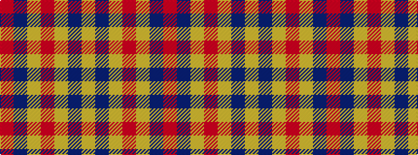

RBYRYBY

It is a 7 stripe tartan.

<figure class="pat-woven">

<figcaption>idealised sample</figcaption>
</figure>

## Colour Sequence



## Tartans with this colour sequence

| Tartans |
|---------------|
| [Manhattan Ethnic](/setts/s7/loi36do15loi9r31lo5do4r16~x2/)|
||
