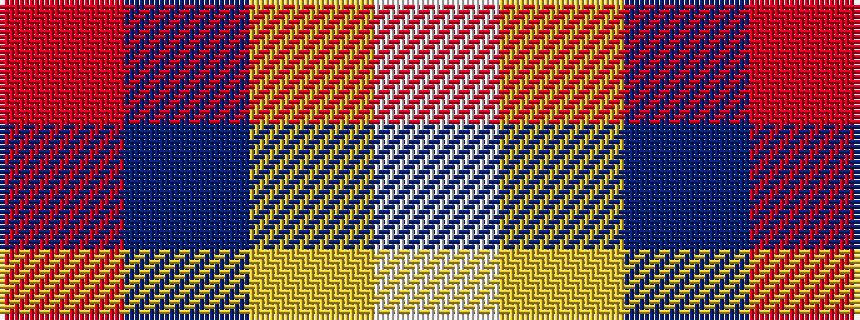

RBYW

It is a 4 stripe tartan.

<figure class="pat-woven">

<figcaption>idealised sample</figcaption>
</figure>

## Colour Sequence



## Tartans with this colour sequence

| Tartans |
|---------------|
| [Kellogg College University of Oxford](/setts/s4/r21db61lo8w21~x2/)|
||
| [Kellogg College University of Oxford](/setts/s4/r21db61ly8w21~x2/)|
||
