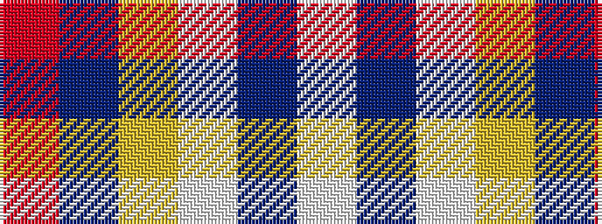

RBYWBW

It is a 6 stripe tartan.

<figure class="pat-woven">

<figcaption>idealised sample</figcaption>
</figure>

## Colour Sequence



## Tartans with this colour sequence

| Tartans |
|---------------|
| [Winnipeg Embroiderers' Guild](/setts/s6/m6n1ly1w1n2w3~x4/)|
||
| [Winnipeg Embroiders' Guild (Corp.)](/setts/s6/r12dt2ly2lb2dt4lb3~x2/)|
||
