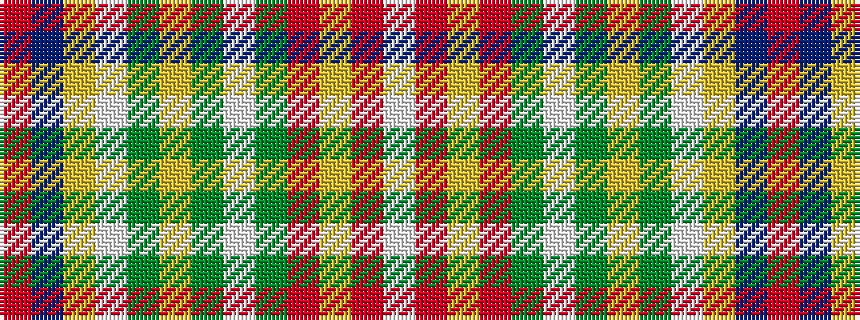

RBYWGYGWGRYRW

It is a 13 stripe tartan.

<figure class="pat-woven">

<figcaption>idealised sample</figcaption>
</figure>

## Colour Sequence



## Tartans with this colour sequence

| Tartans |
|---------------|
| [Isle of Man (District)](/setts/s13/r2t22lo4w3g7ly2g4w2g9m6ly2m4w2~x2/)|
||
