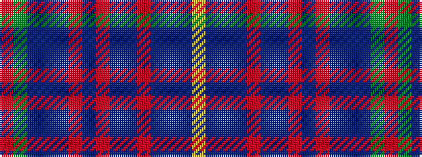

RGBBBRBRBBRBBBY

It is a 15 stripe tartan.

<figure class="pat-woven">

<figcaption>idealised sample</figcaption>
</figure>

## Colour Sequence



## Tartans with this colour sequence

| Tartans |
|---------------|
| [Highland Cathedral (Fashion)](/variants/s15/r4g1db22dbi2dp2r1dp2r4dbi1dp10r2dbi20dp1dbi2ly2~x2/)|
||
