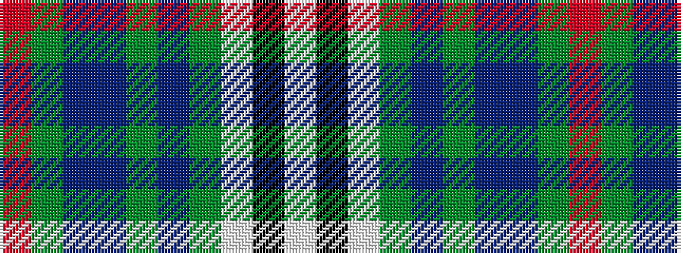

RGBBGBGWKW

It is a 10 stripe tartan.

<figure class="pat-woven">

<figcaption>idealised sample</figcaption>
</figure>

## Colour Sequence



## Tartans with this colour sequence

| Tartans |
|---------------|
| [Edinburgh Dress (Dance)](/setts/s10/w4k2w30g3dp3g3dp7db14g3r3~x2/)|
||
| [Edinburgh, dress](/setts/s10/w4k2w30g3p3g3p7db14g3r3~x2/)|
||
