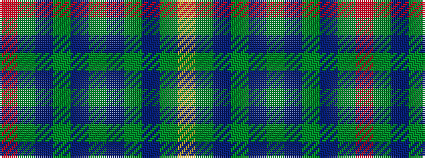

RGBGBGBGBGY

It is a 11 stripe tartan.

<figure class="pat-woven">

<figcaption>idealised sample</figcaption>
</figure>

## Colour Sequence



## Tartans with this colour sequence

| Tartans |
|---------------|
| [Bruce of Crionaich (Personal)](/variants/s11/r1dg8db2dg2db6dg1db6dg2db2dg8ly1~x4/)|
||
| [Bruce of Crionaich (Personal)](/variants/s11/r1g8db2g2db6g1db6g2db2g8ly1~x4/)|
||
