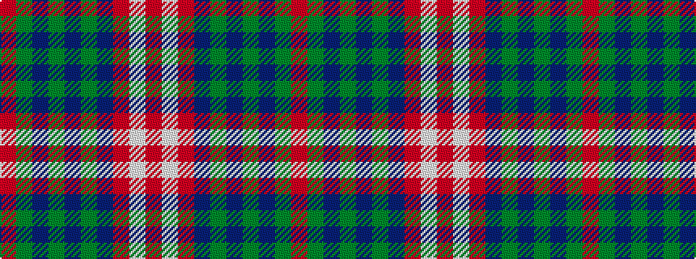

RGBGBGBRWR

It is a 10 stripe tartan.

<figure class="pat-woven">

<figcaption>idealised sample</figcaption>
</figure>

## Colour Sequence



## Tartans with this colour sequence

This pattern is a design lineage: every tartan below shares one colour order, whatever its owner —
near-identical designs are grouped, the largest lineage first (#112: the pattern is a tartan's
second parent, beside its family or clan).

<table class="sett-table">
<tbody>
<tr><td><a href="/setts/r6w1r24db6g2db1g2db1g12r1/">Chisholm</a></td></tr>
<tr><td class="sett-swatch"></td></tr>
<tr><td><a href="/variants/s10/r7w2r32db7g3db2g3db2g16r3~x2/">Chisholm Hunting</a></td></tr>
<tr><td class="sett-swatch"></td></tr>
<tr><td><a href="/variants/s10/r7w2r36db6g3db3g3db3g12r4~x2/">Chisholm of Strathglass</a></td></tr>
<tr><td class="sett-swatch"></td></tr>
<tr><td><a href="/variants/s10/r7w2r36t6dg3t3dg3t3dg12r4~x2/">Chisholm of Strathglass</a></td></tr>
<tr><td class="sett-swatch"></td></tr>
<tr class="cluster-sep"><td></td></tr>
<tr><td><a href="/setts/r6w1r24dr6g2dr1g2dr1g12r1/">Chisholm D</a></td></tr>
<tr><td class="sett-swatch"></td></tr>
<tr class="cluster-sep"><td></td></tr>
<tr><td><a href="/variants/s10/o6w1o24db6g2db1g2db1g12r1~x2/">Chisholm hunting</a></td></tr>
<tr><td class="sett-swatch"></td></tr>
</tbody>
</table>

