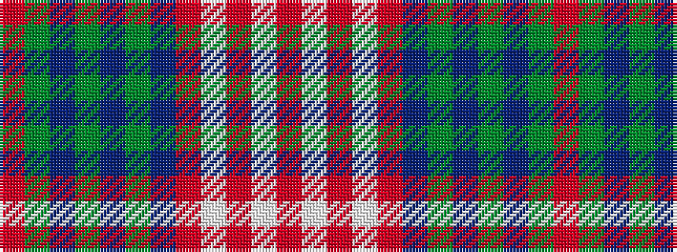

RGBGBGBRWRWR

It is a 12 stripe tartan.

<figure class="pat-woven">

<figcaption>idealised sample</figcaption>
</figure>

## Colour Sequence



## Tartans with this colour sequence

| Tartans |
|---------------|
| [Dorcas (Fashion)](/setts/s12/r4g20dt2g2dt2g3dt6o26lb3o2lb2o4~x2/)|
||
