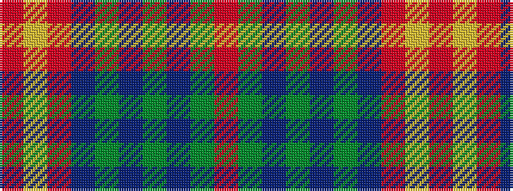

RGBGBGBRYR

It is a 10 stripe tartan.

<figure class="pat-woven">

<figcaption>idealised sample</figcaption>
</figure>

## Colour Sequence



## Tartans with this colour sequence

| Tartans |
|---------------|
| [Chisholm D](/setts/r6lr1r24n6dg2n1dg2n1dg12r1/)|
||
