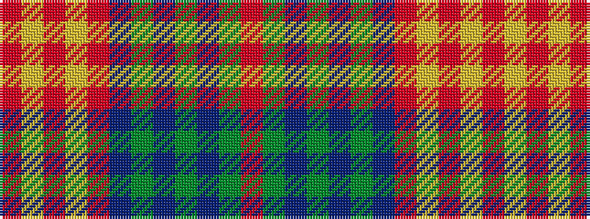

RGBGBGBRYRYR

It is a 12 stripe tartan.

<figure class="pat-woven">

<figcaption>idealised sample</figcaption>
</figure>

## Colour Sequence



## Tartans with this colour sequence

| Tartans |
|---------------|
| [Callum, Brown (Fashion)](/variants/s12/r3dy16db2dy2db2dy3db6o20lr3o2lr2o3~x2/)|
||
