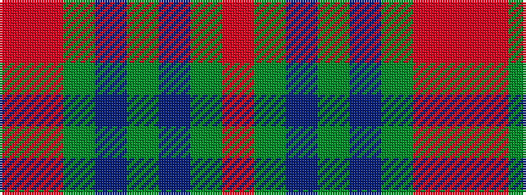

RGBGBGRR

It is a 8 stripe tartan.

<figure class="pat-woven">

<figcaption>idealised sample</figcaption>
</figure>

## Colour Sequence



## Tartans with this colour sequence

| Tartans |
|---------------|
| [Styrian](/variants/s8/o16dg29n19g8n19dg29o16r4~x2/)|
||
