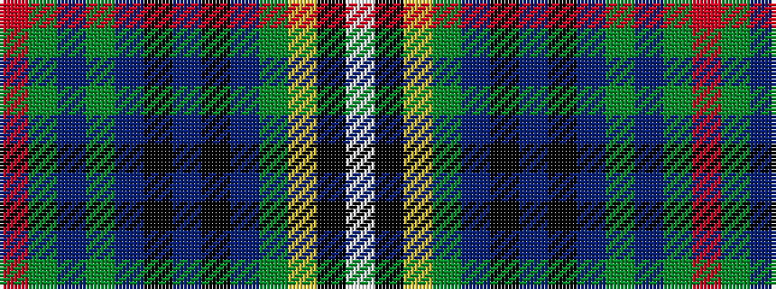

RGBGBKBKBGYKW

It is a 13 stripe tartan.

<figure class="pat-woven">

<figcaption>idealised sample</figcaption>
</figure>

## Colour Sequence



## Tartans with this colour sequence

| Tartans |
|---------------|
| [Joss](/setts/s13/r3g1db2g4db30k2db4k2db30g27ly3k3w3~x2/)|
||
| [Joss (Clan)](/setts/s13/r3dg1db2dg4db30k2db4k2db30dg27ly3k3w3~x2/)|
||
