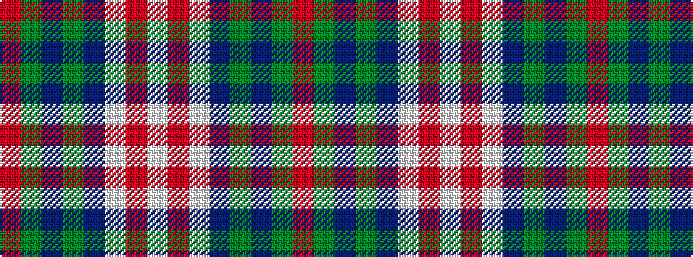

RGBGBWRW

It is a 8 stripe tartan.

<figure class="pat-woven">

<figcaption>idealised sample</figcaption>
</figure>

## Colour Sequence



## Tartans with this colour sequence

| Tartans |
|---------------|
| [Albuquerque, City of](/variants/s8/r2g12db2g8db18w3r2w2~x2/)|
||
