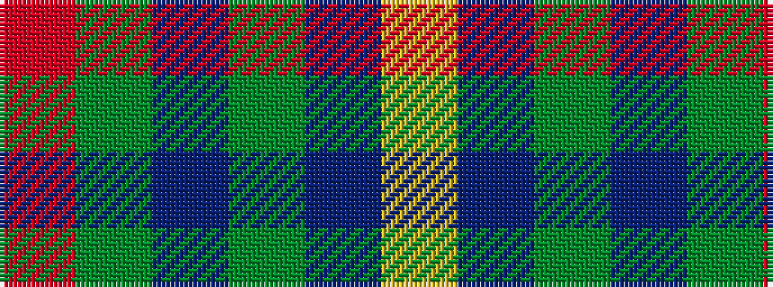

RGBGBY

It is a 6 stripe tartan.

<figure class="pat-woven">

<figcaption>idealised sample</figcaption>
</figure>

## Colour Sequence



## Tartans with this colour sequence

| Tartans |
|---------------|
| [Bobby Jones (Personal)](/setts/s6/r1dy2dt12dy8db16lo1~x2/)|
||
| [Irving of Bonshaw Tower (Personal)](/setts/s6/r2g3db2g14db14lr2~x2/)|
||
