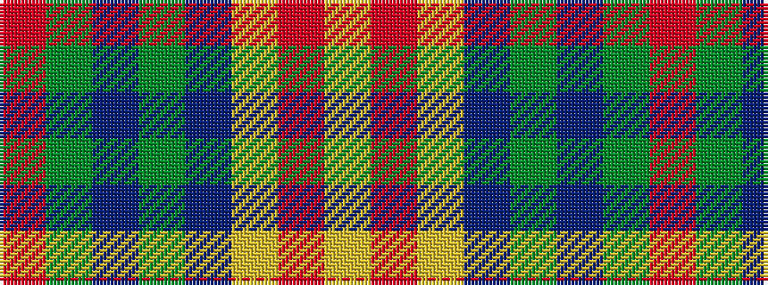

RGBGBYRY

It is a 8 stripe tartan.

<figure class="pat-woven">

<figcaption>idealised sample</figcaption>
</figure>

## Colour Sequence



## Tartans with this colour sequence

| Tartans |
|---------------|
| [New Mexico](/setts/s8/r1g16db2g10db22ly4r2ly1~x2/)|
||
| [New Mexico, State of (Fashion)](/setts/s8/r1g8db1g5db11ly2r1ly1~x4/)|
||
