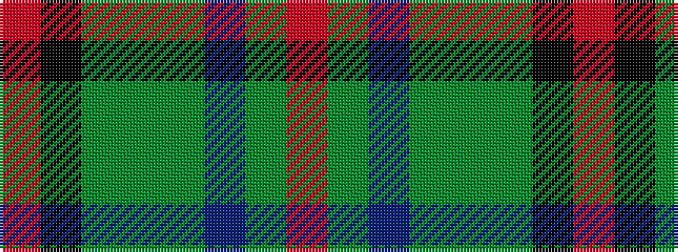

RGBGGGKR

It is a 8 stripe tartan.

<figure class="pat-woven">

<figcaption>idealised sample</figcaption>
</figure>

## Colour Sequence



## Tartans with this colour sequence

| Tartans |
|---------------|
| [Turnbull, Dress Bruce (Personal)](/variants/s8/o11k66y32dg11y10db6y10r4/)|
||
