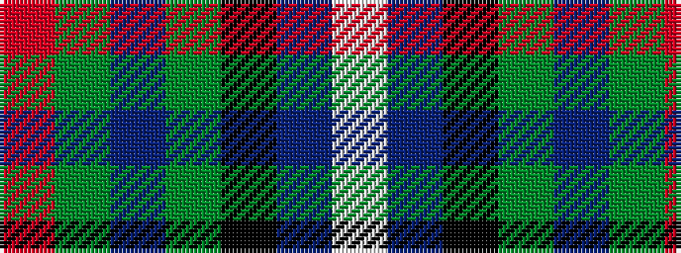

RGBGKBW

It is a 7 stripe tartan.

<figure class="pat-woven">

<figcaption>idealised sample</figcaption>
</figure>

## Colour Sequence



## Tartans with this colour sequence

| Tartans |
|---------------|
| [Royal Burgh of Peebles (District)](/setts/s7/r3g3db4g17k13dt26w3~x2/)|
||
