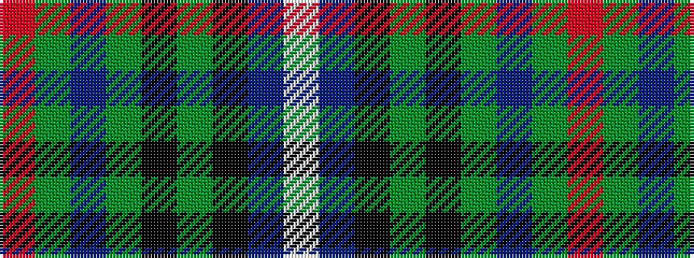

RGBGKGKBW

It is a 9 stripe tartan.

<figure class="pat-woven">

<figcaption>idealised sample</figcaption>
</figure>

## Colour Sequence



## Tartans with this colour sequence

| Tartans |
|---------------|
| [St Andrews Golf Club](/setts/s9/r1dg3t1dg5k1dg1k9db12w1~x4/)|
||
