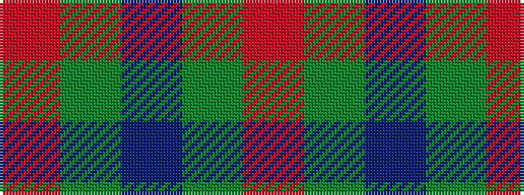

RGBGR

It is a 5 stripe tartan.

<figure class="pat-woven">

<figcaption>idealised sample</figcaption>
</figure>

## Colour Sequence



## Tartans with this colour sequence

| Tartans |
|---------------|
| [Hector James](/variants/s5/r2g5db27g11o2~x2/)|
||
| [Loton (Personal)](/variants/s5/r6dg2db2dg17r2~x4/)|
||
| [MacNab (Smith)](/variants/s5/r24g2t1g1m24~x4/)|
||
| [MacNab 4](/variants/s5/r24g2t1g1ri24~x2/)|
||
