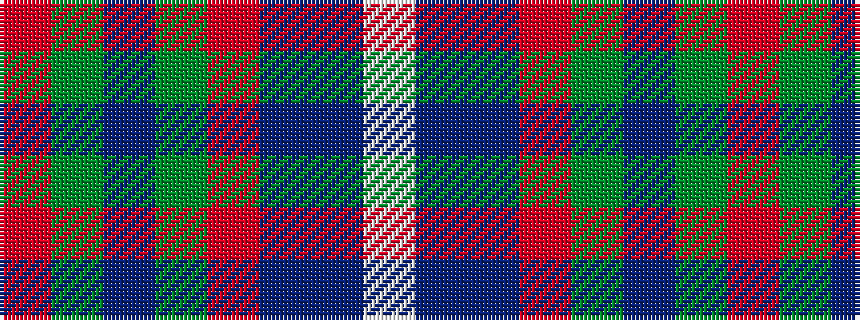

RGBGRBBW

It is a 8 stripe tartan.

<figure class="pat-woven">

<figcaption>idealised sample</figcaption>
</figure>

## Colour Sequence



## Tartans with this colour sequence

| Tartans |
|---------------|
| [Yes Scotland (Fashion)](/variants/s8/o12g4dp4g4o31dt3db12w4~x2/)|
||
