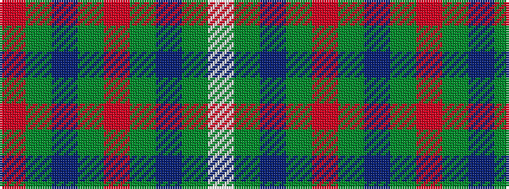

RGBGRGBGW

It is a 9 stripe tartan.

<figure class="pat-woven">

<figcaption>idealised sample</figcaption>
</figure>

## Colour Sequence



## Tartans with this colour sequence

| Tartans |
|---------------|
| [Adamson (Personal)](/variants/s9/r1dy7db3g1o3g1db3g7w1~x4/)|
||
