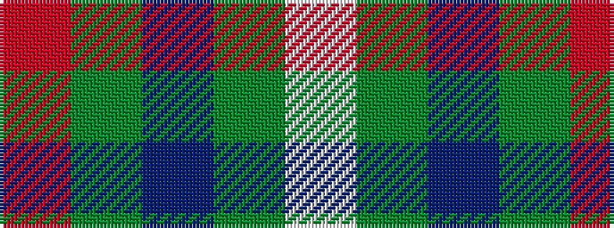

RGBGW

It is a 5 stripe tartan.

<figure class="pat-woven">

<figcaption>idealised sample</figcaption>
</figure>

## Colour Sequence



## Tartans with this colour sequence

| Tartans |
|---------------|
| [Simple Technology (Corporate)](/setts/s5/r3g28db9dg18w3~x2/)|
||
