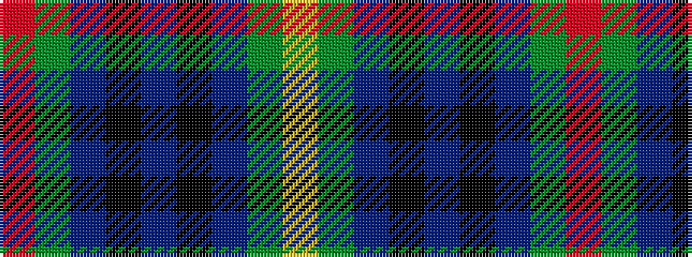

RGBKBKBGY

It is a 9 stripe tartan.

<figure class="pat-woven">

<figcaption>idealised sample</figcaption>
</figure>

## Colour Sequence



## Tartans with this colour sequence

| Tartans |
|---------------|
| [Cambridge (Fashion)](/setts/s9/r4g73db73k4t4k4db73g73ly4/)|
||
