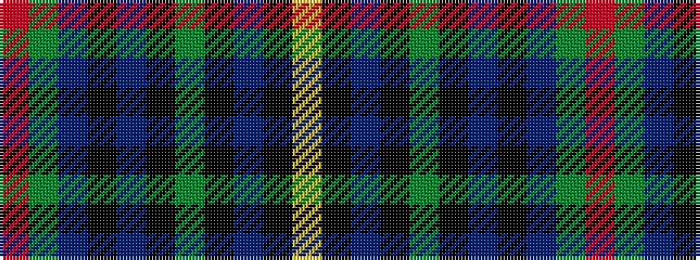

RGBKBKGKBKY

It is a 11 stripe tartan.

<figure class="pat-woven">

<figcaption>idealised sample</figcaption>
</figure>

## Colour Sequence



## Tartans with this colour sequence

| Tartans |
|---------------|
| [Nairn (Edinburgh Woollen Mill)](/setts/s11/r2g10db10k5b2k5g10k10b2k10lo2~x2/)|
||
