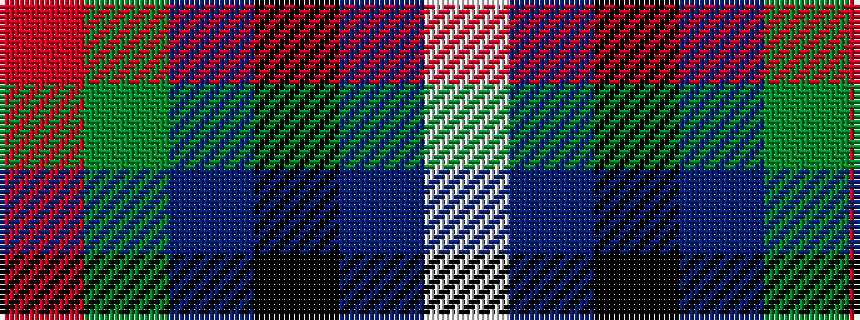

RGBKBW

It is a 6 stripe tartan.

<figure class="pat-woven">

<figcaption>idealised sample</figcaption>
</figure>

## Colour Sequence



## Tartans with this colour sequence

| Tartans |
|---------------|
| [Irving of Glentulchan](/setts/s6/r1g9db9k1db1w1~x6/)|
||
